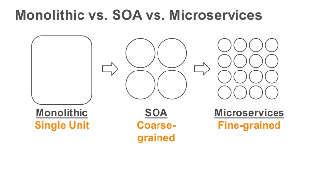
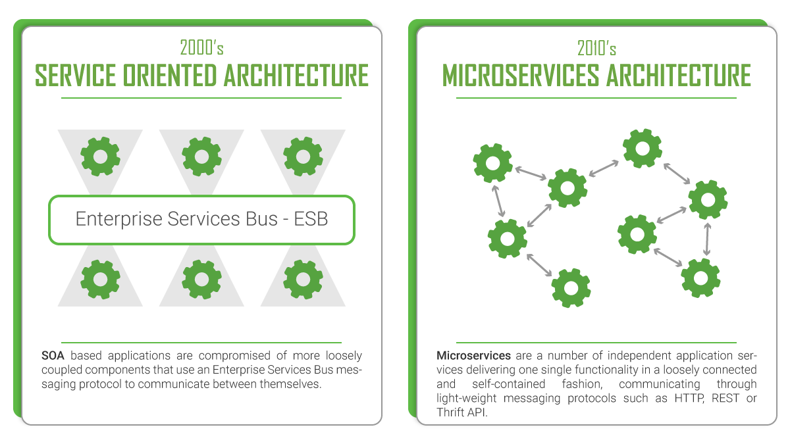
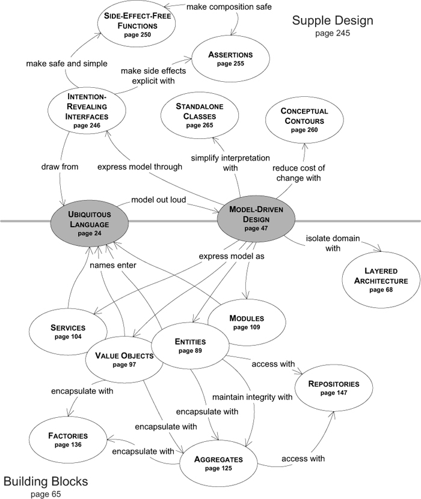

# sam app 

**A public API for member based eCommerce, using the AWS serverless application model, written in [go][^go].** 

This repository and the resources contained herein exemplify a framework for developing and maintaining a tiered network 
of loosely coupled, highly cohesive, server-less micro-services. It also provides scripts, build files, and test data, 
necessary for replicating rapid CI/CD and executing both unit and integration tests.

## Background

 

## Layered Architecture

I agree with [Jake Lumetta][^jlm] regarding how monolithic architectures [still have much to offer][^art] a modern 
software landscape; indeed at least one POC was developed as a monolith and deployed to a single Linux box. That said,
this was not a rational solution.

  

A service oriented architecture is dominant given that service requests and responses of a server-less application model 
are materialized through message oriented middleware.

No architecture is complete without including the two paramount elements of effective Domain-Driven Design: 
1. Establishment of a ubiquitous language for fluid collaboration and uniform communication of the business domain
1.  

## Services

Conceptually, (Micro)services are organized around a single branch of the business domain model and provide discrete 
units of functionality, to achieve predefined business objectives by working alone or with sibling services.

Practically, these are characterized as fine grained and independently deployable, capable of asynchronously 
facilitating decentralized HTTP requests synonymous with modern eCommerce platforms.

## Entities, Values, Aggregates

## License

© Connor Van Elswyk, 1999-2020

Released under the [MIT license](./LICENSE)

***

[^api]: https://www.google.com/search?q=api
[^sam]: https://github.com/awslabs/serverless-application-model
[^sdk]: https://docs.aws.amazon.com/sdk-for-go/api/aws/
[^λƒ]: https://docs.aws.amazon.com/cli/latest/reference/lambda/index.html
[^go]: https://golang.org/
[^yq]: http://mikefarah.github.io/yq/
[^jq]: https://stedolan.github.io/jq/
[^aws]: https://aws.amazon.com/cli/
[^jwt]: https://jwt.io/
[^ddb]: https://docs.aws.amazon.com/amazondynamodb/latest/developerguide/Introduction.html
[^ups]: https://www.ups.com/upsdeveloperkit/announcements
[^soa]: https://en.wikipedia.org/wiki/Service-oriented_architecture
[^mic]: https://en.wikipedia.org/wiki/Microservices
[^jlm]: https://twitter.com/jakelumetta
[^art]: https://blogs.mulesoft.com/dev/tech-ramblings/why-the-monolith-isnt-dead/